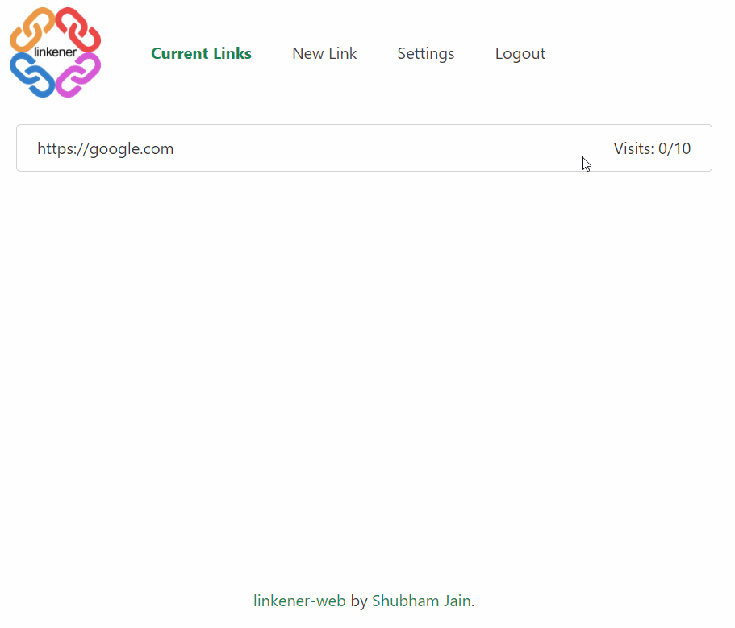
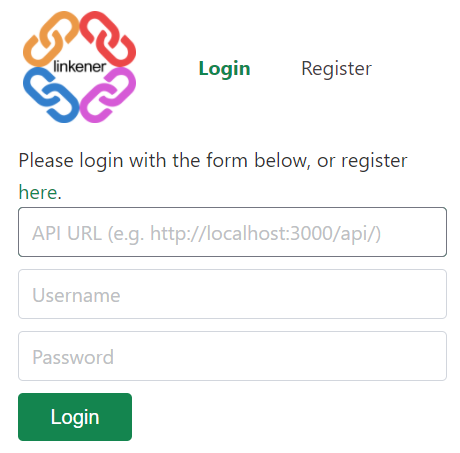
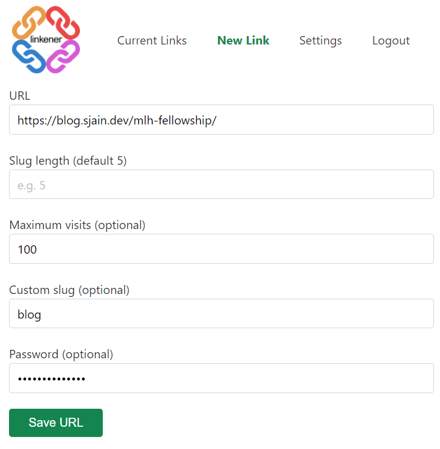

# Linkener Web Client

  [](https://github.com/sponsors/shu8/)

<p align='center'>
    
</p>

An easy to use, minimalistic admin panel wrapped into a web-app for the [_Linkener_ URL shortener (GitHub repo)](https://github.com/shu8/linkener), written using [Svelte](https://svelte.dev/)/[Sapper](https://sapper.svelte.dev/).

It's a Progressive Web App, so can be 'installed' on any mobile device for easy access from anywhere.

## ⭐ Features

- 🔑 User login/registration support
- ⚙ Customizable API endpoint option (connect to any Linkener instance)
- 🌐 Browse through all your Short URLs
- ✏ Edit Short URLs (password, maximum visit count, destinations)
- 📈 View stats for your Short URLs (currently only the HTTP referers and visit count are stored)
- ✒ Create Short URLs (custom slugs, automatic slugs, passwords, maximum visit counts)

It uses [Sapper](https://sapper.svelte.dev/) to be lightweight, fast, and easily customizable.

## 👀 Demo

<p align='center'>
    
</p>

## 📥 Installation

### Docker image

For many cases, using the Docker image (~20MB based on Alpine Linux/Nginx) will be the easiest and fastest way to setup the Linkener Web Client.

```bash
docker run -p 5000:80 shu8/linkener-web:0.1.0
```

This will start a container running the Linkener Web Client on port 5000 (you can change this as desired).

### Docker compose

If you want to build a container yourself, you can use the included [Docker Compose file](./docker-compose.yml) to spin one up!

**Note:** a common scenario where you might need to use this docker compose method is if you want to serve the web-app on a _subpath_ (e.g. `doma.in/admin` compared to at `doma.in/`). The Docker Compose file has a `BASE_PATH` build arg for this case, to be used like `--build-arg BASE_PATH=/YOUR_BASE_PATH`. It will handle all the changes required to make the web-app work on your subpath!

```bash
git clone git@github.com:shu8/linkener-web.git
# Or git clone https://github.com/shu8/linkener-web.git if using HTTPS
# Make your changes to the docker-compose.yml file or the main code and then:
docker-compose up -d [--build-arg BASE_PATH=/admin]
```

### Building manually

It's also really easy to build the project manually!

**Note:** similar to what was mentioned in the Docker Compose section above, if you want to serve the web-app on a subpath, you'll need to export the site a bit differently -- you'll need a `BASE_ENV` environment variable and will need to tweak the `export` command:

```bash
git clone git@github.com:shu8/linkener-web.git
# Or git clone https://github.com/shu8/linkener-web.git if using HTTPS
npm install

# Simple version, when serving on website root:
npm run export

# Advanced version, when serving on a subpath:
BASE_ENV=/admin npm run export --basepath /admin
```

This will produce a static site in the `__sapper__/export` directory, which you can use to serve using something like [Nginx](https://www.nginx.com/) or [Caddy](https://caddyserver.com/).

## 🌐 Hosting

You can choose whether to host this web client on the same server/machine as your main Linkener instance.

If you choose to host it on the same server, you can use something like [Nginx](https://www.nginx.com) to serve both the main Linkener server (see the [`linkener`](https://github.com/shu8/linkener) repo) and this interface on a **subpath**. Your config might look like (**note:** if serving the web-app on a subpath, make sure you've built the container/static site using the relevant instructions above):

```
server {
        listen 80;
        listen [::]:80;

        server_name doma.in www.doma.in;

        location /admin {
            # You might also need:
            # add_header Service-Worker-Allowed /;

            # Linkener web client (local static directory)
            root /path/to/linkener-web/static/dir;
            try_files $uri $uri/ /index.html;

            # Or Linkener web client (docker)
            proxy_pass http://127.0.0.1:5001/admin/;
            proxy_intercept_errors on;
            error_page 404 = /admin/index.html;
        }

        location / {
            # Main Linkener process
            proxy_pass http://127.0.0.1:3000;
        }
}
```

or, if you want to use a **subdomain**:

```
server {
        listen 80;
        listen [::]:80;

        server_name doma.in www.doma.in;

        location / {
            proxy_pass http://127.0.0.1:3000;
        }
}

server {
        listen 80;
        listen [::]:80;

        server_name admin.doma.in www.admin.doma.in;

        root /path/to/linkener-web/static/dir;

        location / {
            # Using local static directory
            try_files $uri $uri/ /index.html;

            # Or using docker
            proxy_pass http://127.0.0.1:5000;
        }
}
```

## ▶ Usage

Once the web-app is running, navigating to the site will show you the login page. You can follow the link to the register page (at `/register`) to create an account on any Linkener instance which has `registration_enabled=true`. You'll need to provide the API URL for the relevant Linkener instance (e.g. `https://doma.in/api/`) -- **note the trailing slash!**):

<p align="center">
    
    
</p>

See the GIF at the top of this README for a demo of all the pages!

## ❓ Why?

This Web Client is to be used with [Linkener](https://github.com/shu8/linkener), to provide a really easy and accessible way to manage your Short URLs.

You're entirely free to make your own client, or use cURL, or Postman, or anything else -- but using this Web Client might be easier in the first instance!

It's written using Svelte/Sapper simply because I wanted to learn more about the frameworks, and wanted to make the web-app fast and static.

## 👩🏾‍💻 Contributing

I'd love contributions! If you're interested in contributing to Linkener, please fork the repo, add your commits, and [open a pull request](https://github.com/shu8/linkener-web/compare/) for reviewing!

Feel free to open an issue first if you want to validate or get suggestions on an idea!

## ℹ Support

Please [open an issue](https://github.com/shu8/linkener-web/issues/new) for support -- from anywhere like reporting bugs, suggesting new features, or help getting Linkener up and running on your setup! :)

## 🔑 License

&copy; [Shubham Jain](https://sjain.dev) 2020, [MIT License](./LICENSE).
